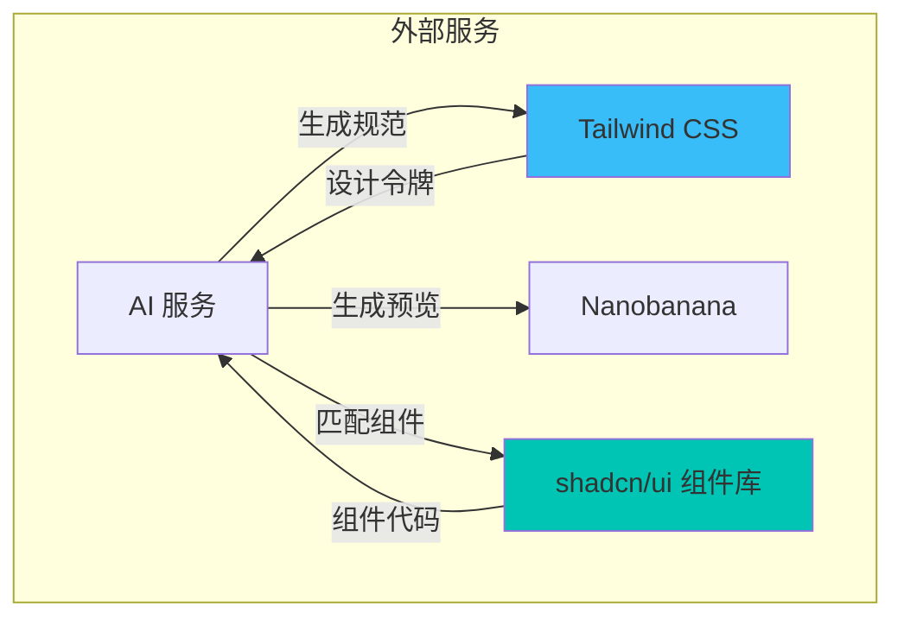
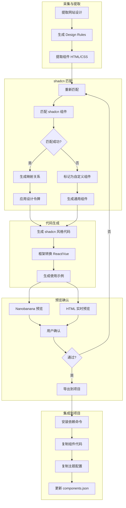

# Design-Learn PRD 更新 - shadcn/ui 集成模块

## 更新内容

### 新增 1.3 目标用户细分

```markdown
### 1.3 目标用户

**核心用户画像：独立开发者**

| 用户类型 | 痛点 | 解决方案 |
|---------|------|---------|
| 独立开发者 | 不懂设计，代码风格不统一 | 自动提取设计规范，生成风格化代码 |
| 全栈开发者 | 手写 UI 效率低 | 匹配 shadcn 组件，一键生成代码 |
| 创业者 | 请不起设计师 | 参考优秀网站设计，复用组件库 |

**用户核心诉求**：
- 省去设计沟通成本（1-2 天/项目）
- 代码可直接运行（90% 可用率）
- 不需要 Figma 订阅
```

### 新增 2.3 外部服务扩展（含 shadcn）



### 新增 3.2.5 ComponentRule（组件匹配规则）

```typescript
interface ShadcnMatch {
  componentId: string;        // shadcn 组件 ID
  componentName: string;      // 组件名称
  confidence: number;         // 匹配置信度 0-1
  
  // 映射关系
  mapping: {
    htmlToJsx: string;        // HTML 到 JSX 的转换规则
    classToProps: string;     // CSS 类名到组件属性的映射
    customStyles: string[];   // 需要自定义的样式
  };
  
  // 变体匹配
  variants: Array<{
    name: string;
    props: Record<string, any>;
   适用场景: string;
  }>;
  
  // Props 推断
  inferredProps: {
    variant?: string;
    size?: 'sm' | 'md' | 'lg';
    disabled?: boolean;
    [key: string]: any;
  };
}
```

### 新增 4.1.4 生成类工具（shadcn 集成）

```typescript
// src/mcp/tools.ts - 新增工具

'generate_shadcn_component': {
  name: 'generate_shadcn_component',
  description: '根据设计规范生成 shadcn/ui 组件代码，自动匹配最合适的组件并应用设计令牌',
  inputSchema: {
    designId: z.string(),
    componentType: z.enum([
      'button', 'input', 'select', 'checkbox', 'radio',
      'card', 'dialog', 'dropdown', 'tabs', 'table',
      'form', 'navigation', 'modal', 'toast'
    ]),
    specifications: z.record(z.string(), z.string()).optional(),
    variant: z.string().optional(),     // 指定变体
    includeDemo: z.boolean().default(true),  // 包含使用示例
    targetFramework: z.enum(['react', 'vue', 'svelte']).default('react')
  }
},

'match_shadcn_components': {
  name: 'match_shadcn_components',
  description: '分析设计资源，匹配最合适的 shadcn/ui 组件',
  inputSchema: {
    designId: z.string(),
    componentCategory: z.enum([
      'actions',      // 按钮、链接等交互组件
      'forms',        // 输入、表单相关
      'layout',       // 卡片、布局组件
      'navigation',   // 导航、菜单
      'overlays',     // 弹窗、对话框
      'data-display'  // 表格、列表等
    ]).optional()
  }
},

'convert_design_to_shadcn': {
  name: 'convert_design_to_shadcn',
  description: '将提取的 HTML/CSS 组件转换为 shadcn/ui 组件代码',
  inputSchema: {
    componentId: z.string(),
    targetFramework: z.enum(['react', 'vue', 'svelte']).default('react'),
    styleFormat: z.enum(['css-modules', 'tailwind', 'inline']).default('tailwind'),
    preserveCustomStyles: z.boolean().default(true)
  }
},

'generate_design_system': {
  name: 'generate_design_system',
  description: '从设计资源生成完整的 Design System，包含 shadcn 配置和 Tailwind 扩展',
  inputSchema: {
    designId: z.string(),
    outputPath: z.string().optional(),
    includeComponents: z.array(z.string()).optional(),
    themeName: z.string()
  }
}
```

### 新增 4.1.5 shadcn 资源定义

```typescript
// src/mcp/shadcn-resources.ts

export const shadcnResources = {
  // shadcn 组件索引
  'shadcn://components/index': {
    uri: 'shadcn://components/index',
    name: 'shadcn 组件索引',
    description: '所有可用 shadcn 组件列表及状态',
    mimeType: 'application/json'
  },
  
  // 单个组件详情
  'shadcn://components/{name}': {
    uri: 'shadcn://components/{name}',
    name: 'shadcn 组件详情',
    description: '单个 shadcn 组件的源码和配置',
    mimeType: 'application/json'
  },
  
  // 匹配结果
  'shadcn://match/{designId}': {
    uri: 'shadcn://match/{designId}',
    name: '组件匹配结果',
    description: '设计资源与 shadcn 组件的匹配详情',
    mimeType: 'application/json'
  },
  
  // 生成的设计系统
  'shadcn://theme/{themeName}': {
    uri: 'shadcn://theme/{themeName}',
    name: '生成的主题配置',
    description: '基于设计资源生成的 Tailwind/shadcn 主题配置',
    mimeType: 'application/json'
  }
};
```

### 新增 4.2.4 提示模板（shadcn 专用）

```typescript
// src/mcp/shadcn-prompts.ts

export const shadcnPrompts = {
  'convert_to_shadcn': {
    name: 'convert_to_shadcn',
    description: '将任意设计转换为 shadcn/ui 组件',
    arguments: [
      { name: 'designId', description: '参考的设计资源 ID' },
      { name: 'componentType', description: '要生成的组件类型' },
      { name: 'framework', description: '目标框架: react | vue' }
    ]
  },
  
  'apply_design_tokens': {
    name: 'apply_design_tokens',
    description: '将设计令牌应用到 shadcn 组件',
    arguments: [
      { name: 'designId', description: '设计资源 ID' },
      { name: 'componentName', description: 'shadcn 组件名' }
    ]
  },
  
  'match_components': {
    name: 'match_components',
    description: '分析设计并推荐最佳匹配的 shadcn 组件',
    arguments: [
      { name: 'designId', description: '设计资源 ID' },
      { name: 'requirements', description: '功能需求描述' }
    ]
  }
};
```

### 新增 5.4 Nanobanana + shadcn 集成服务

```typescript
// src/services/shadcn.service.ts

interface ShadcnIntegration {
  // 组件库定义
  readonly COMPONENTS: {
    [key: string]: {
      name: string;
      category: ComponentCategory;
      variants: string[];
      defaultProps: Record<string, any>;
      cssMapping: CssToPropsMapping;
    };
  };
  
  // 匹配算法
  matchComponent(html: string, designRules: DesignRules): Promise<ShadcnMatch>;
  
  // 代码生成
  generateComponent(
    design: Design,
    componentType: string,
    options: GenerationOptions
  ): Promise<GeneratedComponent>;
  
  // 主题生成
  generateTheme(
    design: Design,
    themeName: string
  ): Promise<ThemeConfig>;
}

class ShadcnService implements ShadcnIntegration {
  
  // shadcn 组件映射表
  readonly COMPONENTS = {
    button: {
      name: 'Button',
      category: 'actions',
      variants: ['default', 'destructive', 'outline', 'secondary', 'ghost', 'link'],
      defaultProps: {
        variant: 'default',
        size: 'default',
        disabled: false
      },
      cssMapping: {
        'primary-bg': 'variant="default"',
        'rounded': 'className="rounded-lg"',
        'shadow': 'className="shadow-sm"'
      }
    },
    input: {
      name: 'Input',
      category: 'forms',
      variants: ['default', 'file'],
      defaultProps: {
        type: 'text',
        placeholder: 'Enter text...'
      },
      cssMapping: {
        'border': 'className="border"',
        'padding': 'className="px-3 py-2"',
        'rounded': 'className="rounded-md"'
      }
    },
    card: {
      name: 'Card',
      category: 'layout',
      variants: ['default', 'horizontal'],
      defaultProps: {},
      cssMapping: {
        'card-bg': 'className="bg-card"',
        'card-border': 'className="border rounded-lg"',
        'card-shadow': 'className="shadow-sm"'
      }
    }
    // ... 更多组件
  };
  
  // 核心匹配方法
  async matchComponent(
    html: string,
    designRules: DesignRules
  ): Promise<ShadcnMatch> {
    // 1. 解析 HTML 结构
    const parsedHtml = this.parseHtmlStructure(html);
    
    // 2. 分析设计特征
    const features = this.analyzeDesignFeatures(parsedHtml, designRules);
    
    // 3. 遍历组件库计算匹配度
    const matches = await Promise.all(
      Object.entries(this.COMPONENTS).map(async ([key, component]) => {
        const confidence = await this.calculateMatchConfidence(features, component);
        return { componentId: key, component, confidence };
      })
    );
    
    // 4. 返回最佳匹配
    const bestMatch = matches
      .filter(m => m.confidence > 0.5)
      .sort((a, b) => b.confidence - a.confidence)[0];
    
    if (!bestMatch) {
      throw new Error('No matching shadcn component found');
    }
    
    // 5. 生成映射关系
    return this.generateMapping(bestMatch, features, designRules);
  }
  
  // 生成组件代码
  async generateComponent(
    design: Design,
    componentType: string,
    options: GenerationOptions
  ): Promise<GeneratedComponent> {
    const match = await this.matchComponent(
      design.components[componentType]?.html || '',
      design.latestVersion?.rules
    );
    
    // 获取基础组件代码
    const baseCode = await this.getShadcnComponent(componentType);
    
    // 应用设计令牌
    const styledCode = this.applyDesignTokens(
      baseCode,
      design.latestVersion?.rules,
      match
    );
    
    // 框架转换
    const finalCode = this.convertFramework(styledCode, options.targetFramework);
    
    return {
      componentType,
      code: finalCode,
      mapping: match.mapping,
      usage: this.generateUsageExample(componentType, match),
      preview: await this.generatePreview(design, componentType)
    };
  }
  
  // 生成 Design System 配置
  async generateTheme(
    design: Design,
    themeName: string
  ): Promise<ThemeConfig> {
    const colors = design.latestVersion?.rules?.colors || [];
    
    // 生成 Tailwind 主题配置
    const tailwindConfig = {
      theme: {
        extend: {
          colors: this.generateColorTokens(colors),
          borderRadius: this.generateSpacingTokens(
            design.latestVersion?.rules?.spacing
          ),
          fontFamily: this.generateTypographyTokens(
            design.latestVersion?.rules?.typography
          )
        }
      }
    };
    
    // 生成 shadcn 组件变体
    const componentVariants = this.generateComponentVariants(
      design.latestVersion?.rules
    );
    
    return {
      name: themeName,
      tailwind: tailwindConfig,
      components: componentVariants,
      utilities: this.generateUtilities(design.latestVersion?.rules)
    };
  }
}
```

### 新增 6.3 shadcn 导入 API

```typescript
// src/routes/shadcn.routes.ts

import { Router } from 'express';
import { ShadcnService } from '../services/shadcn.service.js';

const router = Router();
const shadcnService = new ShadcnService();

/**
 * POST /api/shadcn/match
 * 匹配 shadcn 组件
 */
router.post('/match', async (req, res) => {
  const { designId, componentCategory } = req.body;
  
  const match = await shadcnService.matchComponents(
    designId,
    componentCategory
  );
  
  res.json({ success: true, data: match });
});

/**
 * POST /api/shadcn/generate
 * 生成 shadcn 组件
 */
router.post('/generate', async (req, res) => {
  const { designId, componentType, options } = req.body;
  
  const component = await shadcnService.generateComponent(
    designId,
    componentType,
    options
  );
  
  res.json({ success: true, data: component });
});

/**
 * POST /api/shadcn/theme
 * 生成 Design System
 */
router.post('/theme', async (req, res) => {
  const { designId, themeName } = req.body;
  
  const theme = await shadcnService.generateTheme(
    designId,
    themeName
  );
  
  // 生成文件
  const files = {
    'tailwind.config.js': generateTailwindConfig(theme),
    'components.json': generateComponentsConfig(theme),
    'lib/utils.ts': generateUtils(theme),
    'globals.css': generateCssVars(theme)
  };
  
  res.json({ success: true, data: theme, files });
});

/**
 * GET /api/shadcn/components
 * 获取所有 shadcn 组件列表
 */
router.get('/components', (req, res) => {
  res.json({
    success: true,
    data: shadcnService.getComponentsList()
  });
});

export default router;
```

### 新增 7.2.3 shadcn 集成工作流程



### 新增 7.3 典型使用场景（shadcn 集成）

```markdown
#### 场景：生成符合设计规范的按钮组件

**用户需求**:
"帮我用 Figma 的设计风格做一个提交按钮，要用 shadcn"

**AI 操作**:
```

1. 调用 get_design(designId="figma") 获取设计规范
2. 调用 match_shadcn_components(designId="figma", componentCategory="actions")

→ 匹配到 Button 组件，置信度 0.92

3. 调用 generate_shadcn_component(

designId="figma",

componentType="button",

variant="default"

)

→ 生成组件代码

4. 返回代码和预览图
````

**系统响应**:
```json
{
  "component": "Button",
  "code": `import { Button } from "@/components/ui/button"

export function SubmitButton() {
  return (
    <Button 
      variant="default"
      className="bg-primary text-primary-foreground hover:bg-primary/90"
    >
      提交
    </Button>
  )`,
  "mapping": {
    "bg-blue-600": "className=\"bg-primary\"",
    "text-white": "className=\"text-primary-foreground\"",
    "px-4 py-2": "className=\"px-4 py-2\""
  },
  "theme": {
    "primary": "#3B82F6",
    "primary-foreground": "#FFFFFF"
  }
}
````


**用户确认后**:

- 自动生成安装命令: `npx shadcn@latest add button`
- 复制组件代码到剪贴板
- 生成主题配置代码块
````

### 新增 8.6 shadcn 集成阶段（Phase 5）

```markdown
## Phase 5: shadcn/ui 集成（2-3 周）

| 任务 | 描述 | 依赖 |
|-----|------|------|
| shadcn 组件库解析 | 解析 shadcn 组件源码，提取组件定义 | - |
| 匹配算法实现 | 实现 HTML 到 shadcn 组件的匹配算法 | 组件库解析 |
| 设计令牌映射 | 将提取的颜色、间距等映射到 shadcn | 匹配算法 |
| 代码生成器 | 生成 React/Vue/Svelte 组件代码 | 匹配算法 |
| 主题生成器 | 生成 Tailwind 配置文件和 CSS 变量 | 设计令牌映射 |
| 预览集成 | Nanobanana 预览生成的组件 | 预览功能 |
| VSCode 集成 | 在插件中展示匹配结果和代码 | 代码生成器 |

### 交付物

1. **组件匹配准确率 > 85%**
2. **生成代码 90% 可直接运行**
3. **一键生成完整 Design System 配置**
````


### 新增 10.1 shadcn 组件匹配准确率

| 指标 | 当前 | Phase 5 目标 | 长期目标 |

|-----|------|-------------|---------|

| 按钮匹配准确率 | - | 95% | 98% |

| 输入框匹配准确率 | - | 90% | 95% |

| 卡片匹配准确率 | - | 88% | 93% |

| 整体匹配准确率 | - | 85% | 90% |

| 代码可用率 | - | 90% | 95% |

### 新增 10.2 shadcn 生态集成

```markdown
### 集成范围

| 组件类别 | 组件数量 | 优先级 |
|---------|---------|-------|
| 基础组件 | Button, Input, Select, Checkbox, Radio | P0 |
| 布局组件 | Card, Sheet, Accordion, Tabs | P0 |
| 反馈组件 | Dialog, Alert, Toast, Skeleton | P1 |
| 数据展示 | Table, Badge, Avatar | P1 |
| 导航组件 | Dropdown, Nav, Pagination | P2 |
| 表单组件 | Form, Label, Switch | P1 |

### 主题系统

- 自动生成 `tailwind.config.js`
- 自动生成 `components.json`
- 自动生成 CSS 变量 `globals.css`
- 支持深色模式切换
- 支持主题切换
```

### 新增 11.2 未来扩展 - shadcn 生态

```markdown
### 计划功能

1. **组件变体推荐**
   - 基于设计分析推荐最佳变体组合
   - 自动生成组件使用文档

2. **多框架支持**
   - React (shadcn/ui)
   - Vue (shadcn-vue)
   - Svelte (shadcn-svelte)

3. **设计系统导出**
   - Figma 插件导出
   - Storybook 集成
   - Design Token 标准输出

4. **社区模板**
   - 分享设计系统配置
   - 复用最佳实践
   - 组件市场
```