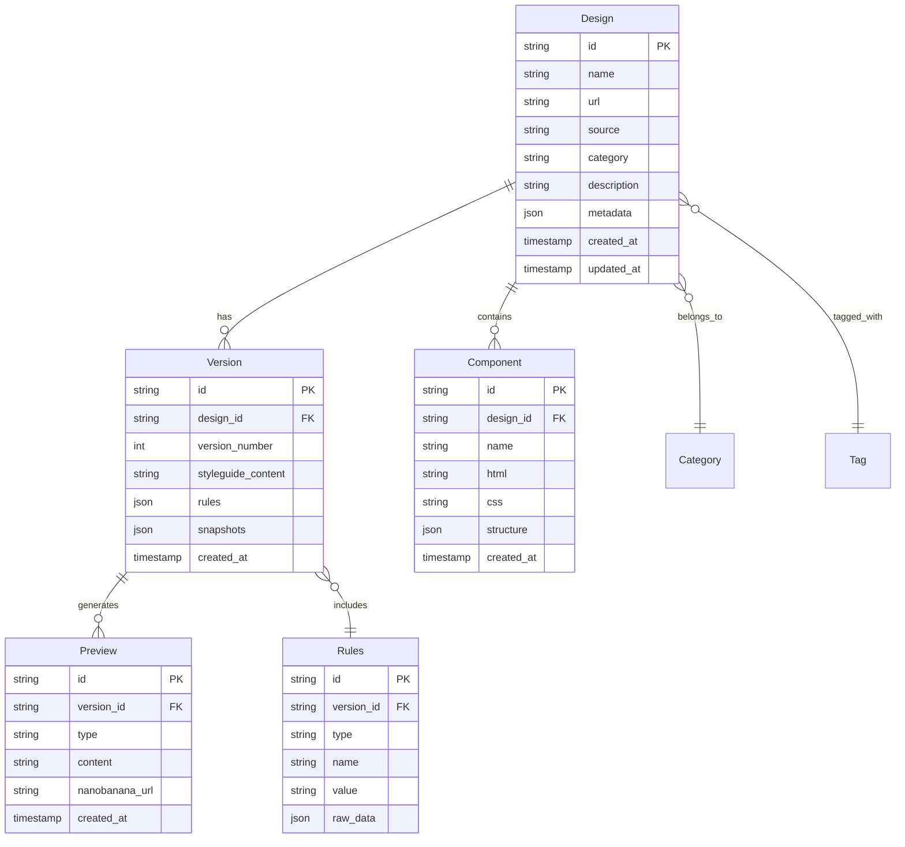
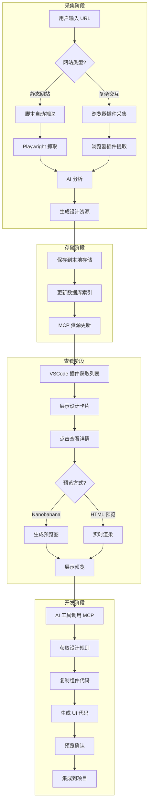

# Design-Learn 产品需求文档

## 文档信息

- **项目名称**: Design-Learn Vibe Coding Platform
- **版本**: v2.0.0 (架构重构版)
- **创建日期**: 2025-12-27
- **更新日期**: 2025-12-27
- **目标**: 构建统一的设计资源管理系统，赋能 AI 辅助前端开发

## 版本变更记录

| 版本 | 日期 | 变更内容 |

|-----|------|---------|

| v1.0.0 | 2025-12-27 | 初始版本 |

| v2.0.0 | 2025-12-27 | 架构重构：统一服务 + 轻量客户端，降低安装成本 |

## 一、产品愿景与目标

### 1.1 产品愿景

打造一个闭环的设计资源管理平台，实现从设计采集到 AI 辅助开发的全流程自动化。通过 MCP 协议连接所有开发工具，让设计师和开发者能够：

- 高效采集和整理优秀的设计案例
- 通过 AI 快速生成符合设计规范的 UI
- 在任意 IDE 中无缝使用设计资源

### 1.2 核心目标

| 目标 | 描述 | 成功指标 |

|-----|------|---------|

| 设计采集效率 | 浏览器插件一键采集网站设计 | 采集时间 < 30秒/网站 |

| 设计管理便捷性 | 统一的 VSCode 管理界面 | 支持分类、标签、搜索 |

| AI 集成深度 | MCP 服务无缝对接 AI 工具 | Cursor/Claude 直接调用 |

| 开发效率提升 | 复制设计 ID 即生成 UI | 生成代码可用率 > 80% |

### 1.3 目标用户

- 前端开发者：需要快速参考设计规范
- 产品设计师：需要收集和管理设计案例
- AI 开发者：需要结构化的设计数据输入

## 二、系统架构设计

### 2.1 架构演进：从分散到统一

#### v1.0 问题分析（当前状态）

```
❌ 当前问题：三套独立实现，数据孤岛

┌─────────────────┐  ┌─────────────────┐  ┌─────────────────┐
│  Chrome 插件     │  │  VSCode 扩展     │  │  Node.js 脚本   │
│  ┌───────────┐  │  │  ┌───────────┐  │  │  ┌───────────┐  │
│  │ IndexedDB │  │  │  │ 文件系统   │  │  │  │ 文件系统   │  │
│  │ (孤立)    │  │  │  │ (孤立)    │  │  │  │ (孤立)    │  │
│  └───────────┘  │  │  └───────────┘  │  │  └───────────┘  │
│  - AI 分析器    │  │  - AI 分析器    │  │  - AI 分析器    │
│  - 模板管理     │  │  - 模板管理     │  │  - 内置模板     │
│  - 任务队列     │  │  - Puppeteer   │  │  - Playwright   │
└─────────────────┘  └─────────────────┘  └─────────────────┘
      ❌ 无法互通           ❌ 无法互通           ❌ 无法互通
```

**功能重复清单**：

| 重复功能 | Chrome | VSCode | Scripts | 问题 |

|---------|--------|--------|---------|------|

| 页面提取器 | Content Script | Puppeteer | Playwright | 3 套代码 |

| AI 分析器 | ai-analyzer.js | aiAnalyzer.ts | ai-analyzer.js | 3 套代码 |

| 提示词模板 | IndexedDB | settings.json | 内置 | 无法共享 |

| AI 模型配置 | IndexedDB | settings.json | .env | 无法共享 |

#### v2.0 目标架构（统一服务 + 轻量客户端）

```
✅ 目标：统一服务，轻量客户端

┌──────────────────────────────────────────────────────────────┐
│              Design-Learn Server (核心服务)                    │
│  ┌────────────────────────────────────────────────────────┐  │
│  │  单一进程 (Bun/Node) - 端口 3000                         │  │
│  │  ┌──────────┬──────────┬──────────┬─────────────────┐  │  │
│  │  │ REST API │ WebSocket│ MCP/SSE  │ Playwright      │  │  │
│  │  │ /api/*   │ /ws      │ /mcp     │ (内置提取)      │  │  │
│  │  └──────────┴──────────┴──────────┴─────────────────┘  │  │
│  │                         ↓                               │  │
│  │  ┌──────────────────────────────────────────────────┐  │  │
│  │  │  统一数据层                                        │  │  │
│  │  │  - SQLite (元数据、配置、模板)                      │  │  │
│  │  │  - 文件存储 (快照、截图、报告)                      │  │  │
│  │  └──────────────────────────────────────────────────┘  │  │
│  └────────────────────────────────────────────────────────┘  │
└──────────────────────────────────────────────────────────────┘
           ↑                    ↑                    ↑
    ┌──────┴──────┐      ┌──────┴──────┐      ┌──────┴──────┐
    │ Chrome 插件  │      │ VSCode 扩展  │      │ Claude/Cursor│
    │ (轻量采集)   │      │ (管理 UI)    │      │ (MCP 调用)   │
    │ → 只做采集   │      │ → 内置服务   │      │ → 只做查询   │
    │ → 发送到服务 │      │ → 只做展示   │      │ → 生成代码   │
    └─────────────┘      └─────────────┘      └─────────────┘
```

### 2.2 单端口统一路由设计

**核心改进**：从 3 个端口简化为 1 个端口，通过路由分发

```
┌─────────────────────────────────────────────────────────────┐
│  Design-Learn Server - 端口 3000 (单一入口)                   │
├─────────────────────────────────────────────────────────────┤
│  路由分发:                                                   │
│  ┌─────────────────────────────────────────────────────┐   │
│  │  /api/*          → REST API (CRUD 操作)              │   │
│  │  /api/designs    → 设计资源管理                       │   │
│  │  /api/snapshots  → 快照管理                          │   │
│  │  /api/config     → 配置管理 (模型、模板)              │   │
│  │  /api/extract    → 触发提取任务                       │   │
│  ├─────────────────────────────────────────────────────┤   │
│  │  /ws             → WebSocket (实时同步)              │   │
│  │  → 任务进度推送                                       │   │
│  │  → 数据变更通知                                       │   │
│  ├─────────────────────────────────────────────────────┤   │
│  │  /mcp            → MCP over SSE (AI 工具连接)        │   │
│  │  → Claude Code / Cursor 直接连接                     │   │
│  │  → 支持 tools / resources / prompts                 │   │
│  └─────────────────────────────────────────────────────┘   │
├─────────────────────────────────────────────────────────────┤
│  服务发现 (自动配置):                                        │
│  - VSCode 插件启动时自动写入 ~/.cursor/mcp.json             │
│  - 浏览器插件通过 /api/health 检测服务状态                   │
└─────────────────────────────────────────────────────────────┘
```

### 2.3 组件职责重新划分

#### Chrome 插件（精简为采集器）

| 保留 | 移除 | 新增 |

|-----|------|------|

| ✅ Content Script 页面提取 | ❌ AI 分析 | ✅ 一键发送到 Server |

| ✅ 快速采集当前页面 | ❌ 任务队列管理 | ✅ Server 连接状态显示 |

| ✅ 基础 UI | ❌ 提示词模板管理 | ✅ 连接码配对 |

| | ❌ 模型配置 | |

#### VSCode 扩展（管理界面 + 内置服务）

| 保留 | 移除 | 新增 |

|-----|------|------|

| ✅ Webview UI 展示 | ❌ Puppeteer 提取 | ✅ **内置 Server** |

| ✅ 快照列表浏览 | ❌ AI 分析逻辑 | ✅ 自动配置 mcp.json |

| ✅ 设计详情查看 | ❌ 独立文件管理 | ✅ 浏览器插件连接码 |

| ✅ 设置面板 | | ✅ 服务状态监控 |

#### Server（新增核心服务）

| 功能模块 | 说明 |

|---------|------|

| 统一数据存储 | SQLite + 文件系统，单一数据源 |

| 统一 AI 分析 | 所有 AI 调用通过 Server |

| 统一配置管理 | 模型、模板、提取选项 |

| MCP 协议支持 | SSE transport，支持 Claude/Cursor |

| Playwright 提取 | 批量提取、路由扫描 |

| 任务队列 | 统一的任务管理和进度追踪 |

### 2.4 通信协议矩阵

| 客户端 | 协议 | 路由 | 认证方式 | 用途 |

|-------|------|------|---------|------|

| 浏览器插件 | HTTP | /api/* | 连接码 | 发送采集数据 |

| 浏览器插件 | WebSocket | /ws | 连接码 | 实时状态同步 |

| VSCode 插件 | 内置 | localhost | 无需认证 | 完整功能 |

| Cursor/Claude | MCP/SSE | /mcp | mcp.json | AI 工具调用 |

| 外部脚本 | HTTP | /api/* | API Key | 批量操作 |

## 三、数据模型设计

### 3.1 核心实体关系



### 3.2 详细数据模型

#### 3.2.1 Design（设计资源）

```typescript
interface Design {
  id: string;                    // 唯一标识 UUID
  name: string;                  // 设计名称
  url: string;                   // 原始网站 URL
  source: string;                // 来源: 'browser' | 'script' | 'import'
  category: string;              // 分类: '国内/协作工具' 等
  description: string;           // 简短描述
  thumbnail: string;             // 缩略图路径
  
  // 统计数据
  stats: {
    components: number;          // 组件数量
    versions: number;            // 版本数量
    lastAnalyzedAt: string;      // 最后分析时间
  };
  
  // 元数据
  metadata: {
    extractedFrom: string;       // 'browser-extension' | 'batch-script'
    extractorVersion: string;
    tags: string[];
  };
  
  createdAt: string;
  updatedAt: string;
}
```

#### 3.2.2 Version（版本记录）

```typescript
interface Version {
  id: string;
  designId: string;
  versionNumber: number;
  
  // 风格指南内容
  styleguideMarkdown: string;
  
  // 提取的规则
  rules: {
    colors: ColorRule[];
    typography: TypographyRule[];
    spacing: SpacingRule[];
    components: ComponentRule[];
    patterns: PatternRule[];
  };
  
  // 快照摘要
  snapshots: Array<{
    url: string;
    title: string;
    screenshotFile: string;
  }>;
  
  createdAt: string;
  createdBy: string;            // 'ai' | 'user'
}
```

#### 3.2.3 Component（组件库）

```typescript
interface Component {
  id: string;
  designId: string;
  versionId: string;
  
  // 组件标识
  name: string;                 // '主按钮' | '导航栏'
  type: string;                 // 'button' | 'nav' | 'card' | 'form'
  
  // 代码
  html: string;
  css: string;
  structure: object;            // 结构化数据
  
  // 预览
  preview: {
    imageUrl: string;           // Nanobanana 生成的预览图
    htmlPreview: string;        // 实时 HTML 预览
  };
  
  // 使用场景
  useCases: string[];
  relatedComponents: string[];
  
  createdAt: string;
}
```

#### 3.2.4 Rules（设计规则）

```typescript
interface ColorRule {
  name: string;                 // '主色调'
  value: string;                // '#3B82F6'
  cssVar: string;               // '--primary-color'
  usage: string[];              // ['按钮背景', '链接颜色']
}

interface TypographyRule {
  name: string;                 // '标题字体'
  fontFamily: string;
  fontSize: string;
  fontWeight: number;
  lineHeight: string;
  cssVar: string;
}

interface SpacingRule {
  name: string;                 // '基础间距'
  unit: string;                 // 'px' | 'rem'
  scale: number[];              // [4, 8, 16, 24, 32]
  cssVar: string;
}
```

### 3.3 存储结构

```
data/
├── designs/                    # 设计资源根目录
│   ├── {designId}/
│   │   ├── design.json         # Design 元数据
│   │   ├── v1/
│   │   │   ├── styleguide.md   # 风格指南
│   │   │   ├── rules.json      # 设计规则
│   │   │   ├── snapshots.json  # 页面快照
│   │   │   ├── components/     # 组件代码
│   │   │   │   └── {componentId}/
│   │   │   │       ├── code.json
│   │   │   │       └── preview.png
│   │   │   └── previews/       # Nanobanana 预览
│   │   └── v2/
│   └── _index.json            # 索引文件
│
├── cache/
│   ├── nanobanana/            # 预览图缓存
│   └── ai-analysis/           # AI 分析缓存
│
└── database.sqlite            # SQLite 元数据库
```

## 四、MCP 协议设计

### 4.1 工具定义（Tools）

```typescript
// design-learn-server/src/mcp/tools.ts
import { z } from 'zod';

export const tools = {
  // ========== 采集类工具 ==========
  'extract_website': {
    name: 'extract_website',
    description: '抓取网站设计风格，生成设计资源',
    inputSchema: {
      url: z.string().url(),
      name: z.string().optional(),
      category: z.string().optional(),
      pages: z.number().min(1).max(20).default(5),
      analyze: z.boolean().default(true)
    }
  },
  
  'import_from_browser': {
    name: 'import_from_browser',
    description: '从浏览器插件导入已采集的设计数据',
    inputSchema: {
      sessionId: z.string()
    }
  },
  
  // ========== 查询类工具 ==========
  'list_designs': {
    name: 'list_designs',
    description: '列出所有已采集的设计资源',
    inputSchema: {
      category: z.string().optional(),
      tag: z.string().optional(),
      search: z.string().optional(),
      limit: z.number().min(1).max(100).default(20)
    }
  },
  
  'get_design': {
    name: 'get_design',
    description: '获取设计资源的详细信息和风格指南',
    inputSchema: {
      designId: z.string(),
      version: z.number().optional()  // 默认最新版本
    }
  },
  
  'search_components': {
    name: 'search_components',
    description: '搜索符合特定条件的组件',
    inputSchema: {
      type: z.enum(['button', 'nav', 'card', 'form', 'modal', 'input']),
      designId: z.string().optional(),
      keywords: z.string().optional()
    }
  },
  
  'get_rules': {
    name: 'get_rules',
    description: '获取设计规则（颜色、字体、间距等）',
    inputSchema: {
      designId: z.string(),
      ruleType: z.enum(['color', 'typography', 'spacing', 'component', 'all']).optional(),
      format: z.enum(['css', 'json', 'markdown']).default('css')
    }
  },
  
  // ========== 预览类工具 ==========
  'generate_component_preview': {
    name: 'generate_component_preview',
    description: '使用 Nanobanana 生成组件 UI 预览',
    inputSchema: {
      componentId: z.string(),
      prompt: z.string().optional(),  // 增强描述
      size: z.object({
        width: z.number().default(400),
        height: z.number().default(300)
      }).optional()
    }
  },
  
  'render_html_preview': {
    name: 'render_html_preview',
    description: '生成 HTML/CSS 实时预览',
    inputSchema: {
      html: z.string(),
      css: z.string().optional(),
      containerSize: z.object({
        width: z.number().default(400),
        height: z.number().default(300)
      }).optional()
    }
  },
  
  // ========== 生成类工具 ==========
  'generate_ui_from_rules': {
    name: 'generate_ui_from_rules',
    description: '根据设计规则生成 UI 代码',
    inputSchema: {
      designId: z.string(),
      componentType: z.string(),
      specifications: z.record(z.string(), z.string()).optional()
    }
  }
};
```

### 4.2 资源定义（Resources）

```typescript
// design-learn-server/src/mcp/resources.ts

export const resources = {
  // ========== 索引类资源 ==========
  'design://index': {
    uri: 'design://index',
    name: '设计资源索引',
    description: '所有设计资源的汇总列表',
    mimeType: 'application/json'
  },
  
  'design://categories': {
    uri: 'design://categories',
    name: '分类目录',
    description: '按分类组织的设计资源列表',
    mimeType: 'application/json'
  },
  
  // ========== 设计详情资源 ==========
  'design://{designId}/meta': {
    uri: 'design://{designId}/meta',
    name: '设计元数据',
    description: '设计的详细信息（不含版本内容）',
    mimeType: 'application/json'
  },
  
  'design://{designId}/latest/styleguide': {
    uri: 'design://{designId}/latest/styleguide',
    name: '最新风格指南',
    description: '当前最新版本的风格指南（Markdown 格式）',
    mimeType: 'text/markdown'
  },
  
  'design://{designId}/v{version}/rules': {
    uri: 'design://{designId}/v{version}/rules',
    name: '设计规则',
    description: '指定版本的设计规则（颜色、字体、间距等）',
    mimeType: 'application/json'
  },
  
  // ========== 组件资源 ==========
  'design://{designId}/components': {
    uri: 'design://{designId}/components',
    name: '组件列表',
    description: '设计中的所有组件',
    mimeType: 'application/json'
  },
  
  'design://{designId}/components/{componentId}': {
    uri: 'design://{designId}/components/{componentId}',
    name: '组件详情',
    description: '单个组件的 HTML/CSS 代码',
    mimeType: 'application/json'
  },
  
  // ========== 预览资源 ==========
  'design://{designId}/previews': {
    uri: 'design://{designId}/previews',
    name: '预览图列表',
    description: 'Nanobanana 生成的预览图',
    mimeType: 'application/json'
  }
};
```

### 4.3 提示模板（Prompts）

```typescript
// design-learn-server/src/mcp/prompts.ts

export const prompts = {
  // ========== 设计分析类 ==========
  'analyze_design_pattern': {
    name: 'analyze_design_pattern',
    description: '分析设计模式并生成可复用的组件',
    arguments: [
      { name: 'designId', description: '设计资源 ID' },
      { name: 'patternType', description: '模式类型: layout | navigation | content | form' }
    ]
  },
  
  'compare_designs': {
    name: 'compare_designs',
    description: '对比多个设计资源，找出共同点和差异',
    arguments: [
      { name: 'designIds', description: '设计资源 ID 数组' },
      { name: 'aspect', description: '对比维度: color | typography | layout | interaction' }
    ]
  },
  
  // ========== 代码生成类 ==========
  'generate_component': {
    name: 'generate_component',
    description: '根据设计规则生成组件代码',
    arguments: [
      { name: 'designId', description: '参考的设计资源 ID' },
      { name: 'componentName', description: '要生成的组件名称' },
      { name: 'variations', description: '需要生成的变体数量' }
    ]
  },
  
  'adapt_design_system': {
    name: 'adapt_design_system',
    description: '将设计转换为你的项目设计系统',
    arguments: [
      { name: 'designId', description: '参考的设计资源 ID' },
      { name: 'targetFramework', description: '目标框架: react | vue | svelte' }
    ]
  }
};
```

## 五、组件详细设计

### 5.1 MCP Server（核心服务）

#### 5.1.1 目录结构

```
design-learn-server/
├── src/
│   ├── index.ts                 # 入口文件
│   ├── server.ts                # MCP Server 配置
│   ├── http-server.ts           # REST API 服务器
│   │
│   ├── mcp/
│   │   ├── tools.ts             # 工具定义
│   │   ├── resources.ts         # 资源定义
│   │   ├── prompts.ts           # 提示模板
│   │   └── handlers.ts          # 处理逻辑
│   │
│   ├── services/
│   │   ├── design.service.ts    # 设计资源管理
│   │   ├── extract.service.ts   # 抓取服务
│   │   ├── analyze.service.ts   # AI 分析服务
│   │   ├── preview.service.ts   # 预览生成服务
│   │   └── sync.service.ts      # 数据同步服务
│   │
│   ├── storage/
│   │   ├── database.ts          # SQLite 操作
│   │   ├── file-manager.ts      # 文件操作
│   │   └── cache.ts             # 缓存管理
│   │
│   ├── extractors/
│   │   ├── browser.ts           # 浏览器插件数据导入
│   │   └── script.ts            # 批量抓取脚本集成
│   │
│   └── utils/
│       ├── logger.ts
│       └── validator.ts
│
├── package.json
└── tsconfig.json
```

#### 5.1.2 核心接口定义

```typescript
// src/server.ts
import { McpServer } from '@modelcontextprotocol/sdk/server/mcp.js';
import { StreamableHTTPServerTransport } from '@modelcontextprotocol/sdk/server/streamableHttp.js';
import { tools } from './mcp/tools.js';
import { resources } from './mcp/resources.js';

const server = new McpServer({
  name: 'design-learn',
  version: '1.0.0'
}, {
  capabilities: {
    tools: Object.keys(tools),
    resources: Object.keys(resources),
    prompts: ['analyze_design_pattern', 'compare_designs', 'generate_component', 'adapt_design_system']
  }
});

// 注册所有工具
Object.entries(tools).forEach(([name, schema]) => {
  server.registerTool(name, schema, handlers[name]);
});

// 启动服务
async function startServer() {
  // HTTP API 服务器 (端口 3000)
  const httpApp = express();
  setupHttpRoutes(httpApp);
  httpApp.listen(3000);
  
  // MCP 服务器 (端口 3001)
  const transport = new StreamableHTTPServerTransport({
    sessionIdGenerator: () => randomUUID()
  });
  await server.connect(transport);
  transport.listen(3001);
}

startServer();
```

### 5.2 VSCode 插件扩展

#### 5.2.1 功能模块

```typescript
// vscode-extension/src/webview/
interface VSCodeFeatures {
  // 侧边栏 - 设计资源管理
  sidebar: {
    designList: TreeView<Design>;
    categoryFilter: QuickPick;
    searchBox: InputBox;
    previewPanel: WebviewPanel;
  };
  
  // 设计详情页
  detailPage: {
    overview: DesignOverview;
    styleguide: MarkdownPreview;
    components: ComponentList;
    versions: VersionHistory;
  };
  
  // 预览面板
  previewPanel: {
    nanobananaImage: ImageView;
    htmlPreview: EditorWebview;
    codeCopy: ClipboardAction;
  };
  
  // 命令面板
  commands: {
    'design-learn.extractWebsite': () => void;
    'design-learn.openDesign': (id: string) => void;
    'design-learn.generatePreview': (componentId: string) => void;
    'design-learn.copyRules': (format: 'css' | 'json') => void;
    'design-learn.setCategory': (id: string, category: string) => void;
  };
}
```

#### 5.2.2 界面布局

```
VSCode 窗口
┌─────────────────────────────────────────────────────────────┐
│  菜单栏                                                      │
├─────────┬─────────────────────────────────────────────────┤
│         │  编辑器区域                                        │
│  侧边栏  │  ┌───────────────────────────────────────────┐  │
│  ┌─────┐│  │                                           │  │
│  │搜索 ││  │  Webview: 设计详情页                       │  │
│  ├─────┐│  │  - 风格指南 Markdown 预览                   │  │
│  │分类 ││  │  - 组件列表                               │  │
│  ├─────┐│  │  - 版本历史                               │  │
│  │设计1││  │                                           │  │
│  │设计2││  └───────────────────────────────────────────┘  │
│  │...  ││                                                 │
│  └─────┘│                                                 │
│         │                                                 │
├─────────┴─────────────────────────────────────────────────┤
│  状态栏                                                      │
└─────────────────────────────────────────────────────────────┘

右键菜单:
├── 提取网站设计
├── 打开设计详情
├── 生成预览图
├── 复制设计规则
└── 设置分类
```

### 5.3 浏览器插件增强

#### 5.3.1 数据导出格式

```typescript
// chrome-extension/lib/export-format.ts

interface BrowserExportData {
  version: '1.0';
  exportedAt: string;
  source: 'browser-extension';
  
  website: {
    url: string;
    title: string;
    favicon: string;
  };
  
  snapshot: {
    html: string;
    css: string;
    screenshot: string;  // base64
    structure: object;
  };
  
  // 可选的 AI 分析结果
  analysis?: {
    styleguide: string;
    components: ComponentData[];
    rules: DesignRules;
  };
  
  // 同步状态
  sync: {
    deviceId: string;
    sessionId: string;
    needsUpload: boolean;
  };
}

// 导出到服务器
async function exportToServer(data: BrowserExportData): Promise<ServerResponse> {
  const response = await fetch('http://localhost:3000/api/designs/import', {
    method: 'POST',
    headers: {
      'Content-Type': 'application/json',
      'X-API-Key': getApiKey()
    },
    body: JSON.stringify(data)
  });
  
  return response.json();
}
```

### 5.4 Nanobanana 集成

```typescript
// src/services/preview.service.ts
import { generateImage } from 'mcp-nanobanana';  // 或直接调用 API

interface PreviewRequest {
  componentId: string;
  prompt: string;
  size: { width: number; height: number };
}

async function generatePreview(request: PreviewRequest): Promise<PreviewResult> {
  // 1. 获取组件 HTML/CSS
  const component = await getComponent(request.componentId);
  
  // 2. 构建 Nanobanana prompt
  const nanobananaPrompt = `
    Generate a UI preview for this component:
    
    Component Name: ${component.name}
    Type: ${component.type}
    
    HTML:
    ${component.html}
    
    CSS:
    ${component.css}
    
    Context: ${request.prompt || 'Clean UI component preview'}
    
    Requirements:
    - Use the exact colors and styles from the provided code
    - Show the component at ${request.size.width}x${request.size.height}px
    - Clean white background
    - Center the component
  `;
  
  // 3. 调用 Nanobanana
  const imageResult = await generateImage({
    prompt: nanobananaPrompt,
    aspectRatio: `${request.size.width}:${request.size.height}`,
    resolution: 'high'
  });
  
  // 4. 保存结果
  const previewPath = savePreviewImage(request.componentId, imageResult);
  
  return {
    componentId: request.componentId,
    imageUrl: previewPath,
    nanobananaId: imageResult.id,
    generatedAt: new Date().toISOString()
  };
}
```

## 六、API 设计

### 6.1 REST API

| 方法 | 端点 | 描述 |

|-----|------|------|

| **设计资源** |||

| GET | /api/designs | 列出所有设计 |

| POST | /api/designs | 创建新设计 |

| GET | /api/designs/:id | 获取设计详情 |

| PUT | /api/designs/:id | 更新设计 |

| DELETE | /api/designs/:id | 删除设计 |

| **版本管理** |||

| GET | /api/designs/:id/versions | 获取版本列表 |

| GET | /api/designs/:id/versions/:v | 获取指定版本 |

| **组件** |||

| GET | /api/designs/:id/components | 获取组件列表 |

| GET | /api/designs/:id/components/:cid | 获取组件详情 |

| **预览** |||

| POST | /api/previews/generate | 生成预览图 |

| GET | /api/previews/:id | 获取预览图 |

| **导入** |||

| POST | /api/import/browser | 从浏览器插件导入 |

| POST | /api/import/url | 从 URL 导入 |

| **系统** |||

| GET | /api/health | 健康检查 |

| GET | /api/categories | 获取分类列表 |

### 6.2 WebSocket 事件

```typescript
// 实时同步事件

interface WSEvents {
  // 设计更新
  'design:created': (design: Design) => void;
  'design:updated': (design: Design) => void;
  'design:deleted': (id: string) => void;
  
  // 版本更新
  'version:created': (version: Version) => void;
  
  // 预览生成进度
  'preview:generating': (componentId: string) => void;
  'preview:completed': (preview: Preview) => void;
  'preview:failed': (componentId: string, error: string) => void;
  
  // 导入状态
  'import:progress': (status: ImportStatus) => void;
  'import:completed': (design: Design) => void;
}

// 使用示例
socket.emit('subscribe', 'design:created');
socket.on('design:created', (design) => {
  // 刷新设计列表
});
```

## 七、工作流程设计

### 7.1 完整工作流程



### 7.2 典型使用场景

#### 场景 1：采集新设计

```
用户操作:
1. 在浏览器插件中输入 URL: https://www.figma.com
2. 点击"提取设计"
3. 插件完成提取，显示预览
4. 点击"同步到服务器"
5. 在 VSCode 中查看和管理

系统响应:
- 浏览器插件 → 上传数据到 localhost:3000
- Server → 触发 AI 分析
- AI 分析完成 → 更新 design.json 和 styleguide.md
- VSCode 插件 → 通过 MCP 获取最新数据并刷新界面
```

#### 场景 2：AI 辅助开发

```
用户需求:
"帮我用 Figma 的设计风格做一个按钮组件"

AI 操作:
1. 调用 MCP 工具 get_rules(designId="figma", type="color,typography")
2. 获取颜色和字体规则
3. 调用 MCP 工具 get_component(designId="figma", type="button")
4. 参考现有按钮组件代码
5. 生成符合设计规范的新按钮代码

系统响应:
- MCP Server → 返回规则 JSON
- AI 生成代码 → 返回给用户
- 用户确认 → 集成到项目
```

#### 场景 3：设计版本管理

```
用户操作:
1. 在 VSCode 中选择设计
2. 点击"查看版本历史"
3. 选择历史版本 v1
4. 对比 v1 和 v2 的差异

系统响应:
- VSCode 插件 → 调用 MCP 工具 list_versions
- 对比显示 → 展示规则变化
- 用户选择 → 恢复到指定版本
```

## 八、安装与部署（极简设计）

### 8.1 安装成本对比

| 方案 | 步骤数 | 用户体验 | 推荐度 |

|-----|-------|---------|-------|

| v1.0 (当前) | 7 步 | ❌ 复杂，易出错 | 不推荐 |

| v2.0 方案 A | **2 步** | ✅ 极简，开箱即用 | **推荐** |

| v2.0 方案 B | 3 步 | ✅ 简单，灵活 | 备选 |

### 8.2 推荐方案：VSCode 插件内置服务（2 步安装）

```
用户只需 2 步：

步骤 1: 安装 VSCode 插件
  └→ VSCode 扩展市场搜索 "Design-Learn"
  └→ 点击安装

步骤 2: (可选) 安装浏览器插件
  └→ Chrome 商店搜索 "Design-Learn Collector"
  └→ 点击安装
  └→ 在 VSCode 中生成连接码，粘贴到浏览器插件

完成！无需任何配置。
```

**自动完成的事项**：

- ✅ Server 随 VSCode 插件启动（内置）
- ✅ 自动写入 `~/.cursor/mcp.json`
- ✅ 自动创建数据目录 `~/design-learn/`
- ✅ 自动检测并配置 Claude Code

### 8.3 VSCode 插件内置服务架构

```typescript
// vscode-extension/src/server/index.ts
import { Hono } from 'hono';
import { serve } from '@hono/node-server';

export class EmbeddedServer {
  private app: Hono;
  private server: ReturnType<typeof serve> | null = null;

  async start(port = 3000) {
    this.app = new Hono();

    // REST API
    this.app.route('/api', apiRoutes);

    // WebSocket (通过 upgrade)
    this.app.get('/ws', upgradeWebSocket(wsHandler));

    // MCP over SSE
    this.app.all('/mcp/*', mcpHandler);

    this.server = serve({ fetch: this.app.fetch, port });

    // 自动配置 mcp.json
    await this.configureMcpJson();
  }

  private async configureMcpJson() {
    const mcpConfigPath = path.join(os.homedir(), '.cursor', 'mcp.json');
    const config = {
      mcpServers: {
        'design-learn': {
          url: 'http://localhost:3000/mcp',
          transport: 'sse'
        }
      }
    };
    // 合并写入，不覆盖其他配置
    await mergeJsonFile(mcpConfigPath, config);
  }
}
```

### 8.4 浏览器插件连接流程

```
┌─────────────────────────────────────────────────────────────┐
│  连接配对流程（一次性）                                        │
├─────────────────────────────────────────────────────────────┤
│                                                             │
│  VSCode 插件                      浏览器插件                 │
│  ┌─────────────┐                 ┌─────────────┐           │
│  │ 生成连接码   │ ──── 复制 ────→ │ 粘贴连接码   │           │
│  │ ABC-123-XYZ │                 │ ABC-123-XYZ │           │
│  └─────────────┘                 └─────────────┘           │
│        │                               │                   │
│        └───────── 验证成功 ─────────────┘                   │
│                      ↓                                     │
│              ┌─────────────┐                               │
│              │ 永久绑定    │                               │
│              │ 无需再配置  │                               │
│              └─────────────┘                               │
└─────────────────────────────────────────────────────────────┘
```

### 8.5 备选方案：独立 Server + 一键脚本（3 步）

```bash
# 步骤 1: 一键安装脚本
curl -fsSL https://design-learn.dev/install.sh | bash

# 脚本自动完成：
# - 检测/安装 Bun (比 Node 更快)
# - 安装 design-learn-server
# - 配置 ~/.cursor/mcp.json
# - 创建 launchd/systemd 服务（开机自启）
# - 打开 VSCode 插件安装页

# 步骤 2: 确认 VSCode 插件安装
# 步骤 3: (可选) 安装浏览器插件
```

### 8.6 MCP 配置自动生成

**Claude Code / Cursor 配置** (`~/.cursor/mcp.json`)：

```json
{
  "mcpServers": {
    "design-learn": {
      "url": "http://localhost:3000/mcp",
      "transport": "sse"
    }
  }
}
```

**Claude Code 配置** (`~/.claude/mcp.json`)：

```json
{
  "mcpServers": {
    "design-learn": {
      "url": "http://localhost:3000/mcp",
      "transport": "sse"
    }
  }
}
```

### 8.7 首次启动引导

```
┌─────────────────────────────────────────────────────────────┐
│  Design-Learn 首次启动向导                                    │
├─────────────────────────────────────────────────────────────┤
│                                                             │
│  ✅ 服务已启动 (localhost:3000)                              │
│                                                             │
│  ✅ MCP 配置已写入                                           │
│     - ~/.cursor/mcp.json                                    │
│     - ~/.claude/mcp.json                                    │
│                                                             │
│  📁 数据目录: ~/design-learn/                                │
│                                                             │
│  ┌─────────────────────────────────────────────────────┐   │
│  │  下一步：配置 AI 模型                                 │   │
│  │                                                     │   │
│  │  [添加 OpenAI Key]  [添加 Claude Key]  [跳过]       │   │
│  └─────────────────────────────────────────────────────┘   │
│                                                             │
│  💡 提示：在 Cursor 中输入 "用 Figma 风格做个按钮"            │
│     即可开始使用 Design-Learn                                │
│                                                             │
└─────────────────────────────────────────────────────────────┘
```

## 九、实施计划

### 9.1 重构策略：渐进式迁移

```
当前状态                    目标状态
┌─────────────┐            ┌─────────────┐
│ Chrome 插件  │ ────────→ │ 轻量采集器   │
│ (完整功能)   │            │ (只做采集)   │
└─────────────┘            └─────────────┘

┌─────────────┐            ┌─────────────┐
│ VSCode 扩展  │ ────────→ │ 内置 Server  │
│ (独立功能)   │            │ + 管理 UI   │
└─────────────┘            └─────────────┘

┌─────────────┐            ┌─────────────┐
│ Node 脚本   │ ────────→ │ Server 模块  │
│ (独立运行)   │            │ (可调用)    │
└─────────────┘            └─────────────┘
```

### 9.2 Phase 1: 核心服务层（MVP）

**目标**: 建立统一的数据服务，验证架构可行性

| 任务 | 描述 | 依赖 | 优先级 |

|-----|------|------|-------|

| 创建 Server 项目 | Hono + Bun 项目结构 | - | P0 |

| SQLite 数据层 | 设计表结构，实现 CRUD | - | P0 |

| REST API | /api/designs, /api/snapshots | SQLite | P0 |

| MCP SSE Transport | /mcp 端点，基础协议 | REST API | P0 |

| 基础 MCP 工具 | list_designs, get_design | MCP | P0 |

### 9.3 Phase 2: VSCode 插件重构

**目标**: 将 Server 内置到 VSCode 插件

| 任务 | 描述 | 依赖 | 优先级 |

|-----|------|------|-------|

| 内置 Server | 插件激活时启动服务 | Phase 1 | P0 |

| 自动配置 mcp.json | 写入 Cursor/Claude 配置 | 内置 Server | P0 |

| 迁移 UI | 复用现有 Webview，对接新 API | REST API | P1 |

| 移除 Puppeteer | 删除独立提取逻辑 | - | P1 |

| 首次启动向导 | 引导用户配置 AI Key | UI | P2 |

### 9.4 Phase 3: 浏览器插件精简

**目标**: 精简为轻量采集器

| 任务 | 描述 | 依赖 | 优先级 |

|-----|------|------|-------|

| 连接码配对 | 实现一次性配对流程 | Server API | P0 |

| 发送到 Server | 采集后直接上传 | 连接码 | P0 |

| 移除 AI 分析 | 删除本地 AI 调用 | - | P1 |

| 移除任务队列 | 删除 IndexedDB 队列 | - | P1 |

| 精简 UI | 只保留采集和状态显示 | - | P2 |

### 9.5 Phase 4: 功能增强

**目标**: 完善核心功能

| 任务 | 描述 | 依赖 | 优先级 |

|-----|------|------|-------|

| Playwright 集成 | Server 内置批量提取 | Phase 1 | P1 |

| WebSocket 同步 | 实时状态推送 | Server | P1 |

| 更多 MCP 工具 | search_components, get_rules | MCP | P1 |

| Nanobanana 预览 | 组件预览生成 | MCP | P2 |

| 离线模式 | 本地缓存和队列 | SQLite | P2 |

### 9.6 迁移检查清单

```
□ Phase 1 完成标志:
  □ Server 可独立运行
  □ MCP 工具可被 Claude/Cursor 调用
  □ 数据存储正常

□ Phase 2 完成标志:
  □ VSCode 插件安装后服务自动启动
  □ mcp.json 自动配置
  □ 现有 UI 功能正常

□ Phase 3 完成标志:
  □ 浏览器插件可连接 Server
  □ 采集数据成功同步
  □ 代码量减少 50%+

□ Phase 4 完成标志:
  □ 批量提取功能可用
  □ 实时同步正常
  □ 预览功能可用
```

## 九-B、配置文件

### 9.1 MCP 配置 (~/.mcp.json)

```json
{
  "mcpServers": {
    "design-learn": {
      "command": "npx",
      "args": ["-y", "design-learn-server"],
      "env": {
        "DESIGN_LEARN_PORT": "3001",
        "DESIGN_LEARN_DATA_DIR": "~/Design-Learn/data"
      }
    }
  }
}
```

### 9.2 VSCode 插件配置

```json
{
  "design-learn": {
    "serverUrl": "http://localhost:3000",
    "mcpEnabled": true,
    "autoRefresh": true,
    "previewDefault": "nanobanana",
    "cache": {
      "enabled": true,
      "maxAge": 86400
    }
  }
}
```

### 9.3 浏览器插件配置

```javascript
// chrome-extension/options/options.js
const config = {
  serverUrl: 'http://localhost:3000',
  apiKey: '',
  autoSync: false,
  extractOptions: {
    pages: 5,
    analyzeWithAI: true,
    generatePreviews: true
  }
};
```

## 十、离线模式与降级策略

### 10.1 离线能力矩阵

| 功能 | 在线模式 | 离线模式 | 降级说明 |

|-----|---------|---------|---------|

| 浏览设计列表 | ✅ 实时 | ✅ 本地缓存 | 使用最后同步的数据 |

| 查看设计详情 | ✅ 完整 | ✅ 已缓存的 | 仅显示已下载的内容 |

| 采集新设计 | ✅ 完整 | ⚠️ 队列等待 | 存入本地队列，联网后同步 |

| AI 分析 | ✅ 实时 | ❌ 不可用 | 提示用户联网后重试 |

| MCP 工具调用 | ✅ 完整 | ⚠️ 只读 | 只能查询本地数据 |

### 10.2 本地缓存策略

```typescript
// 缓存层级
interface CacheStrategy {
  // L1: 内存缓存 (最快，重启丢失)
  memory: {
    maxSize: '100MB',
    ttl: '30min',
    items: ['热门设计', '最近访问']
  };

  // L2: SQLite 缓存 (快，持久化)
  sqlite: {
    maxSize: '1GB',
    items: ['设计元数据', '规则', '组件索引']
  };

  // L3: 文件缓存 (大文件)
  files: {
    maxSize: '10GB',
    items: ['快照HTML', '截图', 'AI报告']
  };
}
```

### 10.3 离线队列机制

```
┌─────────────────────────────────────────────────────────────┐
│  离线操作队列                                                 │
├─────────────────────────────────────────────────────────────┤
│                                                             │
│  用户操作 → 检测网络状态                                      │
│              ↓                                              │
│         ┌────┴────┐                                         │
│         │ 在线？  │                                         │
│         └────┬────┘                                         │
│         是 ↙   ↘ 否                                         │
│        ↓         ↓                                          │
│   直接执行    存入队列                                        │
│        ↓         ↓                                          │
│   返回结果    返回"已排队"                                    │
│                  ↓                                          │
│              网络恢复                                        │
│                  ↓                                          │
│              批量同步                                        │
│                  ↓                                          │
│              通知用户                                        │
└─────────────────────────────────────────────────────────────┘
```

## 十一、错误处理规范

### 11.1 错误码定义

| 错误码 | 类型 | 描述 | 用户提示 |

|-------|------|------|---------|

| E1001 | 网络 | 服务器连接失败 | "无法连接服务，请检查网络" |

| E1002 | 网络 | 请求超时 | "请求超时，请稍后重试" |

| E2001 | 认证 | 连接码无效 | "连接码已过期，请重新生成" |

| E2002 | 认证 | API Key 无效 | "API Key 无效，请检查配置" |

| E3001 | 数据 | 设计不存在 | "找不到该设计资源" |

| E3002 | 数据 | 版本不存在 | "该版本不存在" |

| E4001 | AI | 模型调用失败 | "AI 分析失败，请稍后重试" |

| E4002 | AI | Token 超限 | "内容过长，请缩小范围" |

| E5001 | 提取 | 页面加载失败 | "无法加载目标页面" |

| E5002 | 提取 | 提取超时 | "页面提取超时" |

### 11.2 错误恢复策略

```typescript
interface ErrorRecovery {
  // 自动重试
  autoRetry: {
    maxAttempts: 3,
    backoff: 'exponential', // 1s, 2s, 4s
    retryableErrors: ['E1001', 'E1002', 'E4001']
  };

  // 降级处理
  fallback: {
    'E4001': '使用缓存的分析结果',
    'E5001': '尝试使用浏览器插件采集',
    'E1001': '切换到离线模式'
  };

  // 用户干预
  userAction: {
    'E2001': '引导用户重新生成连接码',
    'E2002': '打开设置页面配置 API Key',
    'E4002': '建议用户选择更少的页面'
  };
}
```

## 十二、性能指标与监控

### 12.1 性能目标

| 指标 | 目标值 | 测量方式 |

|-----|-------|---------|

| 服务启动时间 | < 2s | VSCode 插件激活到服务就绪 |

| API 响应时间 | < 200ms | P95 响应时间 |

| 设计列表加载 | < 500ms | 首屏渲染完成 |

| 单页提取时间 | < 10s | 从请求到快照保存 |

| AI 分析时间 | < 30s | 从请求到报告生成 |

| 内存占用 | < 200MB | Server 进程常驻内存 |

| SQLite 查询 | < 50ms | 单次查询响应 |

### 12.2 资源限制

```typescript
interface ResourceLimits {
  // 存储限制
  storage: {
    maxDesigns: 1000,           // 最大设计数量
    maxSnapshotsPerDesign: 100, // 每个设计最大快照数
    maxTotalSize: '10GB',       // 总存储上限
    cleanupThreshold: '8GB'     // 触发清理的阈值
  };

  // 并发限制
  concurrency: {
    maxExtractTasks: 3,         // 同时提取任务数
    maxAIRequests: 2,           // 同时 AI 请求数
    maxWebSocketConnections: 10 // WebSocket 连接数
  };

  // 请求限制
  rateLimit: {
    apiRequestsPerMinute: 60,
    extractRequestsPerHour: 100,
    aiRequestsPerDay: 500
  };
}
```

### 12.3 健康检查端点

```typescript
// GET /api/health
interface HealthResponse {
  status: 'healthy' | 'degraded' | 'unhealthy';
  version: string;
  uptime: number;
  checks: {
    database: 'ok' | 'error';
    storage: 'ok' | 'warning' | 'error';
    ai: 'ok' | 'unavailable';
  };
  metrics: {
    designCount: number;
    storageUsed: string;
    memoryUsed: string;
    activeConnections: number;
  };
}
```

## 十三、安全模型

### 13.1 认证机制

| 客户端 | 认证方式 | 有效期 | 说明 |

|-------|---------|-------|------|

| VSCode 插件 | 无需认证 | - | 本地服务，信任 |

| 浏览器插件 | 连接码 | 永久 | 一次配对，永久有效 |

| 外部脚本 | API Key | 可配置 | 支持轮换 |

| MCP 客户端 | mcp.json | - | 本地配置文件 |

### 13.2 数据安全

- **本地存储**: 所有数据存储在用户本地，不上传云端
- **API Key 加密**: 使用系统 Keychain 存储敏感信息
- **传输安全**: 本地通信使用 localhost，无需 HTTPS

## 十四、风险与应对

| 风险 | 影响 | 应对措施 |

|-----|------|---------|

| 单点故障 | Server 宕机导致所有功能不可用 | 添加离线缓存和重试机制 |

| 数据安全 | 设计数据泄露 | 添加加密存储和访问控制 |

| 性能瓶颈 | 大量设计导致响应慢 | 添加分页、索引和缓存 |

| Nanobanana 限制 | API 限流或不可用 | 实现本地回退渲染 |

## 十一、扩展性考虑

### 未来功能

- **多用户支持**: 添加用户认证和权限管理
- **团队协作**: 分享和评论功能
- **设计对比**: 多个设计的可视化对比
- **自动分类**: AI 自动给设计打标签
- **模板市场**: 用户分享和发现优秀设计

### 技术扩展

- **插件系统**: 支持自定义分析器
- **云存储**: 可选的云端同步
- **导出格式**: 更多代码框架的导出支持
- **IDE 扩展**: 支持更多 IDE（JetBrains, Vim/Neovim）