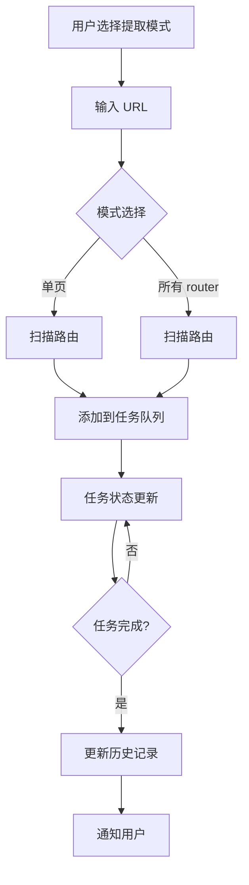

# Design-Learn VS Code 扩展交互优化方案

## 参考 Chrome 插件的设计

Chrome 插件的交互设计包括：

1. **提取模式切换**：current（当前页面）/ all（所有 router 最多 10 个）
2. **任务队列弹窗**：按域名分组显示任务
3. **任务状态**：pending → running → extracted → analyzing → completed/failed
4. **批量操作**：全选/取消全选、清除已完成、重试失败任务
5. **实时进度**：进度条和状态更新
6. **新增任务**：在任务列表中可以继续添加 URL

## 主要改动

### 1. 简化提取选项（对齐 Chrome 插件）

**文件**: `SidebarPanel.ts` (第 449-463 行)

```typescript
// 模式切换
switchMode(mode) {
  this.currentMode = mode;  // 'current' 或 'all'
}

// 提取逻辑
async extract() {
  if (this.currentMode === 'current') {
    await this.extractCurrent();  // 提取单页
  } else {
    await this.extractAll();  // 提取所有 router（最多 10 个）
  }
}
```

### 2. 新增任务管理面板

**新增文件**: `src/webview/TaskManagerPanel.ts`

功能：
- 按域名分组显示任务
- 实时进度更新
- 暂停/继续队列
- 批量操作（清除已完成、重试失败、全选）
- 新增任务输入

### 3. 重构历史记录

**文件**: `SidebarPanel.ts` (第 484-501 行)

将"快照列表"改为按网站分组的历史记录：
- 支持筛选（全部/成功/失败）
- 批量操作（批量分析、批量删除）
- 状态标记

### 4. 新增后端任务管理

**文件**: `design-learn-server/src/storage/sqliteStore.js`

扩展 SQLite 存储，支持任务队列：
```javascript
interface Task {
  id: string;
  url: string;
  domain: string;
  status: TaskStatus;
  progress: number;
  stage?: string;
  error?: string;
  createdAt: string;
  completedAt?: string;
}

enum TaskStatus {
  Pending = 'pending',
  Running = 'running',
  Extracted = 'extracted',
  Analyzing = 'analyzing',
  Completed = 'completed',
  Failed = 'failed'
}
```

### 5. 新增路由扫描 API

**文件**: `design-learn-server/src/server.js`

新增 `/api/scan-routes` 接口，用于扫描网站的路由：
```typescript
// 扫描网站路由
POST /api/scan-routes
Body: { url: string, limit?: number }
Response: { routes: string[], total: number }
```

## 实现步骤

### 步骤 1: 后端任务管理

1. ✅ 扩展 `sqliteStore.js` - 新增任务表和任务管理方法
2. ✅ 扩展 `storage/index.js` - 新增任务管理方法
3. ✅ 新增 `/api/tasks/*` 接口
4. ✅ 新增 `/api/scan-routes` 接口

### 步骤 2: 

1. ⏳ 新增 `TaskManagerPanel.ts` - 任务管理 Webview
2. ⏳ 新增任务管理 HTML/CSS 样式

### 步骤 3: 侧边栏改造

1. ⏳ 修改 SidebarPanel.ts - 支持模式切换
2. ⏳ 修改侧边栏 UI - 添加任务管理入口
3. ⏳ 重构历史记录显示

### 步骤 4: 集成测试

1. ⏳ 测试单页提取
2. ⏳ 测试批量 router 提取
3. ⏳ 测试任务管理功能
4. ⏳ 测试历史记录分组

## 数据流



## 风险与注意事项

1. **并发控制**: 批量提取时限制并发数（建议 3-5 个并发）
2. **性能优化**: 大量任务需要分页或虚拟滚动
3. **数据持久化**: 任务状态需要持久化，支持重启后恢复
4. **路由扫描**: 需要处理同源策略限制

## 已完成的更新

### 2026-01-04 更新

#### 1. 数据库 schema 更新
- 将 SCHEMA_VERSION 从 1 升级到 2
- 新增 `tasks` 表，包含字段：
  - id, url, domain, status, progress, stage, error
  - options_json, created_at, updated_at, completed_at
- 新增索引：idx_tasks_status, idx_tasks_domain, idx_tasks_created_at

#### 2. 任务管理方法
新增以下存储方法：
- `createTask(input)` - 创建任务
- `listTasks(filters)` - 列出任务（支持按状态、域名筛选）
- `getTask(taskId)` - 获取单个任务
- `updateTask(taskId, patch)` - 更新任务状态
- `deleteTask(taskId)` - 删除任务
- `clearCompletedTasks()` - 清除已完成/失败的任务

#### 3. API 接口
新增以下 API 端点：
- `GET /api/tasks` - 列出所有任务（按域名分组返回）
- `POST /api/tasks` - 创建新任务
- `GET /api/tasks/:id` - 获取任务详情
- `PATCH /api/tasks/:id` - 更新任务
- `DELETE /api/tasks/:id` - 删除任务
- `POST /api/tasks/:id/retry` - 重试任务
- `DELETE /api/tasks/clear-completed` - 清除已完成任务
- `POST /api/scan-routes` - 扫描网站路由

#### 4. 响应格式
`GET /api/tasks` 返回格式：
```json
{
  "tasks": [...],
  "groups": {
    "example.com": [...],
    "another.com": [...]
  },
  "stats": {
    "total": 10,
    "pending": 5,
    "running": 2,
    "completed": 2,
    "failed": 1
  }
}
```


